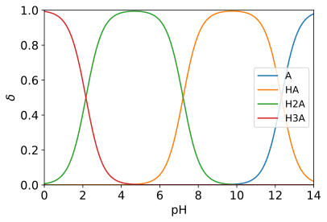
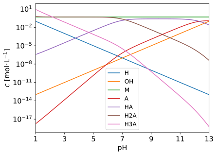
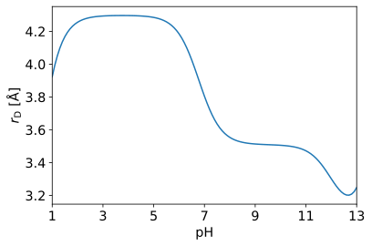
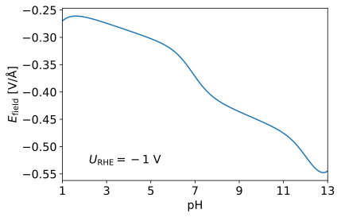

## 酸碱组分的平衡浓度与分布分数

溶液中某酸碱组分的平衡浓度占其总浓度的分数，称为分布分数（distribution fraction），以表示。

### 应用
1. 确定离子浓度，然后估算弱电解质溶液的双电层厚度。
2. 确定物种的主要状态，然后使用对应的状态计算自由能。

### 已知条件
参考[CRC Handbook of Chemistry and Physics](<https://hbcp.chemnetbase.com/faces/contents/ContentsSearch.xhtml>) Page 5-87。

### Python求解过程
参考《分析化学》武汉大学（第五版）上册第5.2节（P116-118）。
```python
import numpy as np
import matplotlib.pyplot as plt


class Distribution_Fraction:

    def __init__(self, pKa=[13.995,], pH=np.linspace(0, 14, 301)):
        self.pKa = pKa # pKa1, pKa2, pKa3, pKa4, ...
        self.pH = pH # pH
        n = len(pKa)

        # 计算分布分数
        H = 10.**(-np.array(pH))
        Ka = 10.**(-np.array(pKa))
        c = np.repeat(Ka.reshape(n, 1), len(pH), axis=1)
        self.delta = [np.prod(c, axis=0),]
        for i in range(-1, -n-1, -1):
            c[i] = H
            self.delta.append(np.prod(c, axis=0))
        self.delta /= np.sum(self.delta, axis=0)

        # 获得化学式
        self.formula = ['A',]
        for i in range(1, n+1):
            self.formula.append(f'H{i:d}A'.replace('H1A', 'HA'))

    def plot(self, ax): # 绘图
        for formula, delta in zip(self.formula, self.delta):
            ax.plot(self.pH, delta, label=formula)
        ax.legend(fontsize='large')
        ax.axis((0, 14, 0, 1))
        ax.tick_params(labelsize='x-large')
        ax.set_xlabel(r'$\mathregular{pH}$', fontsize='x-large')
        ax.set_ylabel(r'$\delta$', fontsize='x-large')
        return ax


if __name__ == '__main__':

    distribution = Distribution_Fraction(pKa=[6.35, 10.33]) # CRC Page 5-87
    plt.figure(facecolor='w')
    ax = plt.gca()
    distribution.plot(ax=ax)
    plt.savefig('H2CO3.svg', bbox_inches='tight')
```

### 计算结果
碳酸溶液。见CRC Page 5-87。图例中的A是。
<center></center>
磷酸溶液。见CRC Page 5-87。图例中的A是。
<center></center>
甲酸溶液。见CRC Page 5-92。图例中的A是。
<center></center>
氨水。见CRC Page 5-87。图例中的A是。
<center></center>


### 磷酸钾溶液的电化学性质
#### 绘制浓度对数图
在磷酸钾溶液中，离子的浓度是0.5 mol/L。求溶液中各组分的浓度与pH的关系。

```python
pH = np.linspace(1, 13, 121) # 设定: pH范围
pKa = [2.16, 7.21, 12.32] # 设定: CRC Page 5-87
M = 0.5 # 设定: 钾阳离子浓度，单位mol/L
qM = 1 # 设定: 钾阳离子带正电荷是+1
qA = -3 # 设定: 完全解离的磷酸根阴离子所带电荷是-3

npts = len(pH)
q = np.arange(len(pKa)+1) + qA # 完全/未完全解离的各物种所带电荷
H = 10.**(-np.array(pH)) # 计算氢离子浓度
OH = 10.**(-np.array(14-pH)) # 计算氢氧根离子浓度
M = np.repeat(M, npts) # 钾阳离子浓度
distribution = Distribution_Fraction(pKa=pKa, pH=pH)
c = -(H-OH+qM*M)/(distribution.delta*q.reshape(-1, 1)).sum(axis=0) # 电荷平衡
concentrations = np.insert(c*distribution.delta, 0, [H, OH, M], axis=0).T # H, OH, M, A, HA, H2A, H3A, ...

plt.figure(facecolor='w')
ax = plt.gca()
ax.plot(pH, concentrations.T[0], label='H')
ax.plot(pH, concentrations.T[1], label='OH')
ax.plot(pH, concentrations.T[2], label='M')
for i, formula in enumerate(distribution.formula):
	ax.plot(pH, concentrations.T[3+i], label=formula)
ax.legend(fontsize='large')
ax.set_xlim(pH[[0, -1]])
ax.set_xticks(np.arange(pH[0], pH[-1]+0.1, 2))
ax.set_yscale('log')
ax.tick_params(labelsize='x-large')
ax.set_xlabel(r'$\mathregular{pH}$', fontsize='x-large')
ax.set_ylabel(r'$c\ [\mathrm{mol}\!\cdot\!\mathrm{L}^{-1}]$', fontsize='x-large')
plt.savefig('concentrations.svg', bbox_inches='tight')
```

<center></center>

#### 计算德拜长度

双电层（electrical double layer），电极和电解质溶液界面的模型。其中假设在电极的表面上有一层正电荷，而在紧挨着它的溶液中则有一层负电荷（或者相反）。

德拜长度即双电层厚度，由温度、离子所带电荷及其对应浓度、溶剂的介电常数共同决定：
<center></center>

```python
from ase.units import _eps0, kB, J, C, mol, m

temperature = 298.15
eb_k = 249.21 - 0.79069*temperature + 0.00072997*temperature**2 # CRC P6-220

def get_lambda_d_k(charge_numbers=(1, -1), concentrations=(1, 1), temperature=298.15):
    lambda_d_k = ((_eps0*eb_k*kB/J*temperature)/(np.divide(charge_numbers, C)**2*np.multiply(concentrations, mol*1e+03)).sum(axis=-1))**0.5*m
    return lambda_d_k

charge_numbers = np.insert(q, 0, (1, -1, qM)).reshape(1, -1).repeat(npts, axis=0)
lambda_d_k = get_lambda_d_k(charge_numbers, concentrations)

plt.figure(facecolor='w')
ax = plt.gca()
ax.plot(pH, lambda_d_k)
ax.set_xlim(pH[[0, -1]])
ax.set_xticks(np.arange(pH[0], pH[-1]+0.1, 2))
ax.tick_params(labelsize='x-large')
ax.set_xlabel(r'$\mathregular{pH}$', fontsize='x-large')
ax.set_ylabel(r'$r_{\mathregular{D}}\ [\mathrm{\AA}]$', fontsize='x-large')
plt.savefig('lambda_d_k.svg', bbox_inches='tight')
```

<center></center>

#### 计算显式电场强度

```python
def get_U_SHE(U_RHE, pH=0., T=298.15):
    U_SHE = U_RHE - kB*T*np.log(10)*pH
    return U_SHE

U_RHE = -1 # 设定: 偏压等于-1 V vs. RHE（阴极）

plt.figure(facecolor='w')
ax = plt.gca()
ax.plot(pH, get_U_SHE(U_RHE, pH, T=temperature)/lambda_d_k)
ax.text(x=0.1, y=0.1, s=r'$U_{\mathrm{RHE}}=%s\ \mathrm{V}$'%U_RHE, fontsize='x-large', transform=ax.transAxes)
ax.set_xlim(pH[[0, -1]])
ax.set_xticks(np.arange(pH[0], pH[-1]+0.1, 2))
ax.tick_params(labelsize='x-large')
ax.set_xlabel(r'$\mathregular{pH}$', fontsize='x-large')
ax.set_ylabel(r'$E_{\mathregular{field}}\ [\mathrm{V}/\mathrm{\AA}]$', fontsize='x-large')
plt.savefig('efield.svg', bbox_inches='tight')
```

<center></center>

[[Back]](../)
