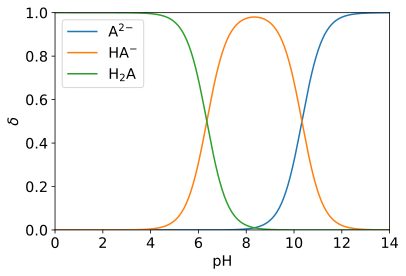

## 计算酸溶液的分布分数

### 概念
溶液中某酸碱组分的平衡浓度占其总浓度的分数，称为分布分数（distribution fraction），以$ delta $表示。

### 应用
可确定阴阳离子浓度，然后估算弱酸溶液的双电层厚度。

### 已知条件
pKa来自CRC
求解过程参考分析化学P116-118

### Python求解过程
```Python3
import numpy as np
import matplotlib.pyplot as plt


def get_delta(pK_a, pH): # 计算分布分数
    c_H = 10.**(-np.array(pH))
    K_a = 10.**(-np.array(pK_a))
    npts = pH.shape[0]
    n = len(pK_a)
    K_a = np.repeat(K_a.reshape(n, 1), npts, axis=1)
    delta = [np.prod(K_a, axis=0),]
    for i in range(-1, -n-1, -1):
        K_a[i] = c_H
        delta.append(np.prod(K_a, axis=0))
    delta /= np.sum(delta, axis=0)
    return delta


def get_label(n_H, charge): # 获得标签
    if n_H == 0: # 化学式中的氢个数
        H = ''
    elif n_H == 1:
        H = '\mathrm{H}'
    else:
        H = r'\mathrm{H}_{%d}' % i
    if charge == 0: # 带电荷数
        q = ''
    else:
        q = f'{charge:+d}'
        if abs(charge) == 1:
            q = q[:1]
        else:
            q = f'{q[1:]}\!{q[0]}'
    label = r'$%s\mathrm{A}^{%s}$'  % (H, q)
    return label


if __name__ == '__main__':

	pH = np.linspace(0, 14, 301) # pH值
	pK_a = [6.35, 10.33] # pKa1, pKa2, pKa3, ...

	delta = get_delta(pK_a=pK_a, pH=pH) # 分布分数
	n = len(pK_a)

	plt.figure(facecolor='w')
	ax = plt.gca()
	for i in range(n+1):
		ax.plot(pH, delta[i], label=get_label(i, -n+i))
	ax.set_xlabel('$\mathregular{pH}$', fontsize='x-large')
	ax.set_ylabel('$\delta$', fontsize='x-large')
	ax.tick_params(labelsize='x-large')
	ax.axis((0, 14, 0, 1))
	ax.legend(fontsize='x-large')
	plt.savefig('H2CO3.svg', bbox_inches='tight')
```


### 计算结果
<center></center>

### 参考
1. Sander, R.: Compilation of Henry's law constants (version 4.0) for water as solvent, Atmos. Chem. Phys., 15, 4399–4981, [https://doi.org/10.5194/acp-15-4399-2015](<https://acp.copernicus.org/articles/15/4399/2015/>), 2015.
2. [亨利定律常数表](<https://max.book118.com/html/2017/0528/109971917.shtm>)
3. [Atkins' Physical Chemistry 11e](<https://global.oup.com/academic/product/atkins-physical-chemistry-11e-9780198817895?q=atkins&lang=en&cc=us>) P152-153

[[Back]](../)
