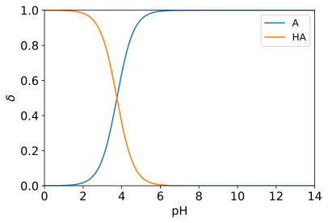

## 酸碱组分的平衡浓度与分布分数

溶液中某酸碱组分的平衡浓度占其总浓度的分数，称为分布分数（distribution fraction），以表示。

### 应用
1. 确定离子浓度，然后估算弱电解质溶液的双电层厚度。
2. 确定物种的主要状态，然后使用对应的状态计算自由能。

### 已知条件
参考[CRC Handbook of Chemistry and Physics](<https://hbcp.chemnetbase.com/faces/contents/ContentsSearch.xhtml>) Page 5-87。

### Python求解过程
参考《分析化学》武汉大学（第五版）上册第5.2节（P116-118）。
```python
import numpy as np
import matplotlib.pyplot as plt


class Distribution_Fraction:

    def __init__(self, pKa=[13.995,], pH=np.linspace(0, 14, 301)):
        self.pKa = pKa # pKa1, pKa2, pKa3, pKa4, ...
        self.pH = pH # pH
        n = len(pKa)

        # 计算分布分数
        H = 10.**(-np.array(pH))
        Ka = 10.**(-np.array(pKa))
        c = np.repeat(Ka.reshape(n, 1), len(pH), axis=1)
        self.delta = [np.prod(c, axis=0),]
        for i in range(-1, -n-1, -1):
            c[i] = H
            self.delta.append(np.prod(c, axis=0))
        self.delta /= np.sum(self.delta, axis=0)

        # 获得化学式
        self.formula = ['A',]
        for i in range(1, n+1):
            self.formula.append(f'H{i:d}A'.replace('H1A', 'HA'))

    def plot(self, ax): # 绘图
        for formula, delta in zip(self.formula, self.delta):
            ax.plot(self.pH, delta, label=formula)
        ax.legend(fontsize='large')
        ax.axis((0, 14, 0, 1))
        ax.tick_params(labelsize='x-large')
        ax.set_xlabel(r'$\mathregular{pH}$', fontsize='x-large')
        ax.set_ylabel(r'$\delta$', fontsize='x-large')
        return ax


if __name__ == '__main__':

    distribution = Distribution_Fraction(pKa=[6.35, 10.33]) # CRC Page 5-87
    plt.figure(facecolor='w')
    ax = plt.gca()
    distribution.plot(ax=ax)
    plt.savefig('H2CO3.svg', bbox_inches='tight')
```

### 计算结果
碳酸溶液。见CRC Page 5-87。图例中的A是。
<center></center>
磷酸溶液。见CRC Page 5-87。图例中的A是。
<center></center>
甲酸溶液。见CRC Page 5-92。图例中的A是。
<center></center>
氨水。见CRC Page 5-87。图例中的A是。
<center></center>

[[Back]](../)
