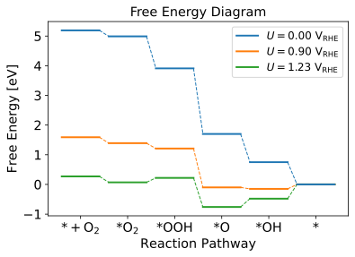
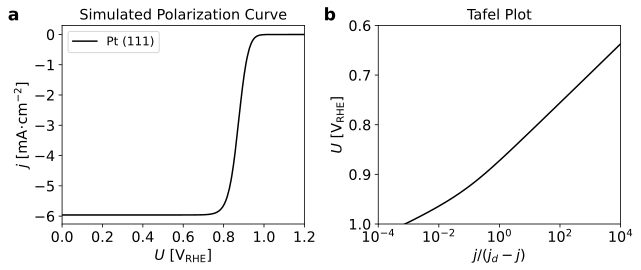
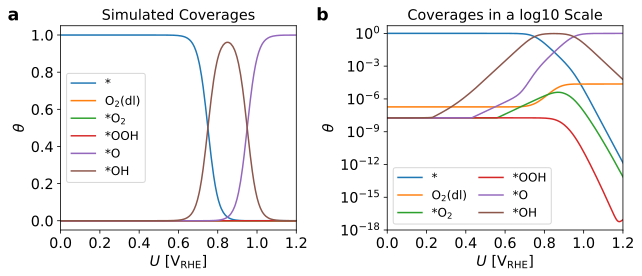

## 电催化微观动力学建模

### 设计ORR反应过程

1. O2从本体溶液中扩散到电极附近<center></center>
2. O2从电极附近的溶液中移到电极上，形成吸附在反应位点A的\*O2<center></center>
3. H+和已经被吸附在反应位点A上的\*O2反应生成\*OOH中间体<center></center>
4. H+和已经被吸附在反应位点A上的\*OOH中间体反应生成\*O中间体和H2O<center></center>
5. H+和已经被吸附在反应位点A上的\*O中间体反应生成\*OH中间体<center></center>
6. H+和已经被吸附在反应位点A上的\*OH中间体反应生成H2O<center></center>

### 建立微分方程

#### 反应速率常数
1. 对于化学反应<center></center>
2. 写成包含指前因子的形式<center></center>
2. 对于电化学反应<center></center>
3. 重新写一遍<center></center>
4. 逆反应速率常数<center></center>
5. 平衡常数<center></center>

#### 质量作用定律（law of mass action）
基元反应的速率与反应物浓度（含有相应的指数）的乘积成正比，其中各浓度的指数就是反应式中各反应物质的计量系数。净的右向反应速率取决于正向及逆向反应速率的总结果，即
<center></center>
<center></center>
<center></center>
<center></center>
<center></center>
<center></center>

#### 稳态近似法（steady state approximation method）
可以近似地认为在反应达到稳定状态后，中间体的浓度基本上不随时间而变化。对ORR过程中产生的中间体作稳态近似，得
<center></center>
<center></center>
<center></center>
<center></center>
<center></center>
<center></center>

#### 表面位点守恒（conservation of surface sites）
假设所有反应中间体占据1个位点，即
<center></center>

#### 求解速率方程

#### 速控步近似
在一系列的连续反应中，若其中有一步反应的速率最慢，它控制了总反应的速率，使反应的速率基本等于最慢一步的速率，则这最慢的一步反应称为速控步（rate controlling step）或决速步（rate determining step），即
<center></center>
根据总反应，
<center></center>
<center></center>
<center></center>

#### 计算电流密度
单位面积电极上通过的电流
<center></center>

### 使用CatMAP求解

#### 输入文件

##### `ORR_input.txt`文件
```
surface_name	site_name	species_name	formation_energy	bulk_structure	frequencies	other_parameters	reference
None	gas	pe	0.0	None	[]	[]	gas phase calcs
None	gas	H2O	0.0	None	[]	[]	Hansen 2014
None	gas	O2	5.19	None	[]	[]	Hansen 2014
Pt	a	O2	4.99	fcc	[]	[]	Hansen 2014
Pt	dl	O2	5.19	fcc	[]	[]	Hansen 2014
Pt	a	OOH	3.91	fcc	[]	[]	Hansen 2014
Pt	a	O	1.7	fcc	[]	[]	Hansen 2014
Pt	a	OH	0.75	fcc	[]	[]	Hansen 2014
Pt	dl	*	0.0	fcc	[]	[]	Hansen 2014
```


##### `ORR.mkm`文件
```python
scaler = 'ThermodynamicScaler' # use T/p/U as descriptors and treat energetics as a constant

rxn_expressions = [
    'O2_g + *_dl <-> O2_dl; prefactor=8e5',                    # rxn 1 - O2 to O2 in double layer
    '*_a + O2_dl -> O2_a + *_dl; prefactor=1e8',               # rxn 2 - O2 double layer adsorption to a
    'O2_a + pe_g -> ^0.26eV_a -> OOH_a; prefactor=1e9',        # rxn 3 - O2 -> OOH on a
    'OOH_a + pe_g -> ^0.26eV_a -> O_a + H2O_g; prefactor=1e9', # rxn 4 - OOH -> O + H2O on a
    'O_a + pe_g -> ^0.26eV_a -> OH_a; prefactor=1e9',          # rxn 5 - O -> OH on a
    'OH_a + pe_g -> ^0.26eV_a -> *_a + H2O_g; prefactor=1e9',  # rxn 6 - OH -> H2O on a
]

surface_names = ['Pt',]

descriptor_names= ['voltage', 'temperature'] # voltage/temperature/pressure
descriptor_ranges = [[0., 1.23], [298.15, 298.15]]
resolution = [151, 1]

beta = 0.5

species_definitions = {}
# assume heine's free energy numbers are already pressure-corrected
species_definitions['H2O_g'] = {'pressure': 1.}
species_definitions['O2_g'] = {'pressure': 2.34e-05}
species_definitions['pe_g'] = {'pressure': 1.}

species_definitions['a'] = {'site_names': ['a'], 'total': 1.}
species_definitions['dl'] = {'site_names': ['dl'], 'total': 1.}

data_file = 'ORR.pkl'
input_file = 'ORR_input.txt'

gas_thermo_mode = 'frozen_gas'
adsorbate_thermo_mode = 'frozen_adsorbate'
electrochemical_thermo_mode = 'simple_electrochemical'

decimal_precision = 200
tolerance = 1e-50
max_rootfinding_iterations = 1000
max_bisections = 5
```

##### `mkm_job.py`文件

#### 计算结果
电流密度

覆盖度


[[Back]](../)
